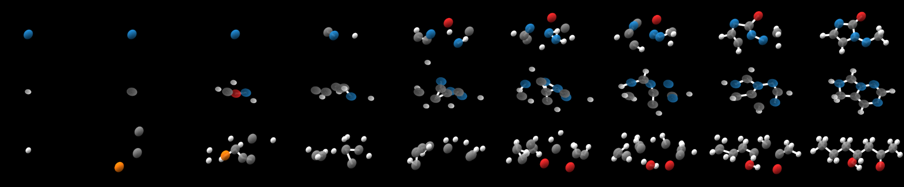

# Trans-Dimensional Generative Modeling via Jump Diffusion Models

This repository contains the code for our paper introducing jump diffusions for modeling varying dimensional data.

We include notebooks for visualizing molecule samples and interpolations as well as code for our video models. Pretrained models are also provided for our molecule and video models.